Consider the problem of a self-driving car. What if, the car could predict the motion of objects around it using a sequence of image frames? It would definitely enhance its ability to apply brakes in case of an emergency and thus make our lives a lot safer.

Have you ever faced a situation where you're watching your favorite sport on TV and the video freezes for an instant, and you miss out on an important event which could be the crux of the entire episode? You would definitely want to throw your remote and break your TV!

In this blog, we present an approach to tackle the above problems using deep learning.  The goal of this project is to predict future video frames by learning the dynamics of a given scene. This blog post is aimed at providing a high-level summary of approaches and models that worked for us along with results. One thing which we realized is that Deep Learning is not a piece of cake. We faced a number of issues while getting the models to work. Specifically, if you are looking for what problems we faced and how we overcame them, this is the place to look [at] (https://team-pragmatic-chaos.github.io/timeline/).


Table of Contents
=================

   * [Table of Contents](#table-of-contents)
      * [Data Preparation](#data-preparation)
         * [Datasets](#datasets)
         * [Batch Generation](#batch-generation)
         * [Selection at an interval](#selection-at-an-interval)
      * [Loss Function](#loss-function)
      * [Models](#models)
         * [Sequence to Sequence Model](#sequence-to-sequence-model)
            * [Architecture](#architecture)
            * [Results](#results)
            * [Expected vs Generated Output](#expected-vs-generated-output)
            * [Advantages and Disadvantages](#advantages-and-disadvantages)
          * [Autoencoder Model](#autoencoder-model)
            * [Architecture](#architecture-1)
            * [Results](#results-1)
            * [Expected vs Generated Output](#expected-vs-generated-output-1)
            * [Advantages and Disadvantages](#advantages-and-disadvantages-1)
         * [Multi-Scale Model](#multi-scale-model)
             * [Architecture](#architecture-2)
             * [Results](#results-2)
             * [Advantages and Disadvantages](#advantages-and-disadvantages-2)
      * [Evaluation](#evaluation)
      * [Future Scope](#future-scope)
      * [Summary &amp; Conclusion](#summary--conclusion)
      * [References](#references)

## Data Preparation

### Datasets

Since the project is concerned with video frames prediction, it is very obvious that the model would need a lot of videos to get something meaningful out of it. This is to ensure that the model is trained well enough to predict the future frames.

We use the famous [UCF-101 dataset](http://crcv.ucf.edu/data/UCF101.php) for training the model. It is currently the largest dataset of human actions. It consists of 101 action classes and over 13k clips and 27 hours of video data. The classes describe different human actions which have been uploaded by the users containing camera motion and cluttered background.

Because some of the categories in the UCF-101 dataset have very little movement, we removed such categories altogether from the dataset. 

#### Preprocessing the input
The model requires the pixel values for all of the video frames to be in the range `[-1,1]`. To achieve this, each of the video , say X, is preprocessed using the formula X = (X - 127.5) / 127.5 instead of providing the raw video as input.
```python
def image_processing(X):
    X = (X - 127.5) / 127.5
    return X
```

#### Postprocessing the output
Because the model uses a tanh function at the end, the output generated by the model has pixel values lying in between `[-1,1]`. This output undergoes postprocessing so as to generate video frames. Say, the model produces a video X, X is postprocessed using the formula X = X * 127.5 + 127.5.
```python
def image_postprocessing(X):
    X = (X * 127.5) + 127.5
    return X
```

### Batch Generation
Each batch consists of a certain number of videos and each video consists of a certain number of frames. The starting frame for each such video in a batch is selected randomly. 


For example, if the batch contains 4 videos and each video contains 4 continuous frames then, for video-1 in the batch, we generate a random number between `[0,1,2,3,...,(N-1)-4]` where video-1 contains `N` frames. Suppose the number `2` is generated, then the frames `2, 3, 4, 5` become the input for video-1 in the current batch. 

Similar selection logic follows for other videos in the batch.

### Selection at an interval
After experimenting with a few videos, we observed that picking continuos frames does not capture any significant movement in the actual video. In order to overcome this, we came up with an approach of selecting video frames with a certain interval in between the selected frames rather than having continuous frames. 


Let's take the same example as above. Suppose we generate the number `1` and we are using an interval of `1` frame, then the frames `1, 3, 5, 7` are selected as input for video-1 in the current batch. 

## Loss Function
We use the GDL loss which calculates difference with respect to surrondings pixels to focus on local changes rather than global changes.


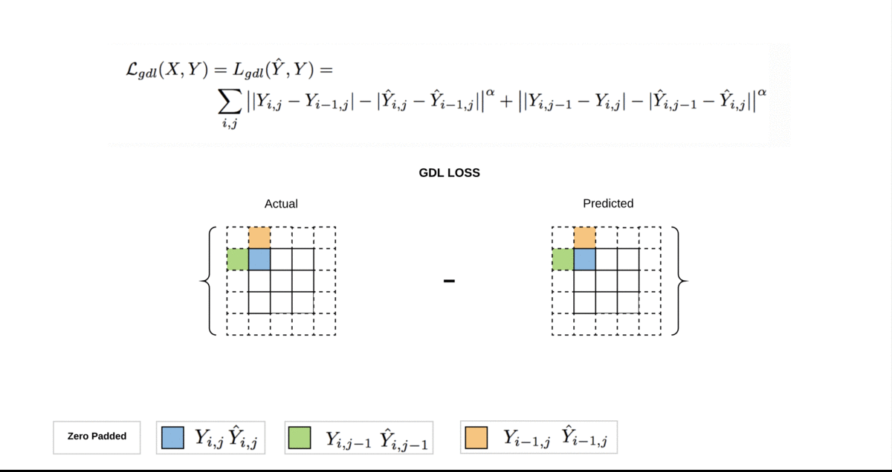

## Models
The following section presents 3 models based on LSTM and Convolution that worked the best for our task.

Each model takes multiple frames as an input and predicts future frames as an output. The raw images that are fed into the models are converted to feature maps using convolutional layers. The predicted frames are then obtained by performing deconvolutions on feature maps.

### Sequence to Sequence Model

#### Architecture
A sequence to sequence (seq2seq) model takes in a sequence of inputs (such as a sequence of video frames), observes each input element in the sequence and encodes it into some fixed representation. The model can then predict the next sequence of elements using this encoded information and previously predicted frames.


Every video frame is passed through Convolutional layers and converted to a feature map which is then fed to seq2seq model which contains Convolutional LSTM (Conv LSTM) cells. This procedure is common to both encoder and decoder in the model. In the decoder, the output generated by LSTM Convolutional cell is passed through a Deconvolutional layer which generates the predicted frame. This predicted frame is passed as an input to the next decoder cell.

The model takes in 4 frames as input and tries to predict the next 4 frames in the sequence as the output.

#### Training and Testing
During testing, the previously predicted frames is passed as input to the decoder. In contrast, at training time, we pass the actual frames of the video as input to the decoder.

In our case, we used a batch size of 16 videos with 4 frames per video. Out of these 4 frames, the first 3 frames are passed as input to the encoder while the 4th frame acts as the initial input to the decoder.

#### Model tweaks
On top of the baseline model as described above we tried the following tweaks as an attempt to improve performance.
Here is a quick summary of what we tried along with the intuition behind them:

- Teacher Forcing: We decided to remove teacher forcing from above model
during training so that each unit sums correct teacher activations as input for the next iteration instead of only summing activations from incoming units.
- Batch Normalization: After training the above model, we found that the capacity of the network was not enough to make good predictions. Therefore, we increased number of Conv-Deconv layers and introduced a Batch Normalization layer.


#### Results
#### Graphs

#### Expected vs Generated Output
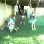


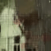


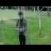


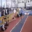


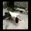


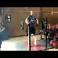
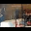


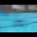


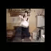


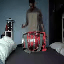
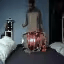


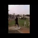

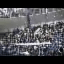


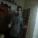


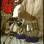

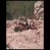


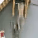

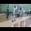

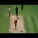


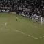


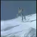
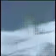


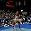


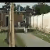
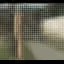
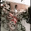


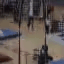


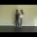


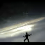


#### Advantages and Disadvantages
This seq2seq model is able to capture the features of the steady background in the video very well. 

However,  seq2seq is not able to capture motion very well. We observe that the predicted frames are blurred and the bluriness increases with motion. Another major problem is this model can not be scaled for large images as it has Conv-LSTM cells in between the Conv and DeConv layers. Conv-LSTM cells have fixed memory and we cannot handle large sized images during test time.


### Autoencoder Model

#### Architecture
An autoencoder model is used for unsupervised learning in which the model tries to reconstruct the input so that the generated output is as similar as possible to the given input. At a high level, there are 2 symmetrical parts to an autoencoder - an encoder part and a decoder part. The encoder part of the network takes in raw images/video frames as input and tries to generate a vector representation or an encoding for the given input. The decoder part of the network takes this encoding of the input and tries to reconstruct the output as similar as possible to the input.


In our case, we make the decoder generate the next video frame given the current video frame instead of reconstructing the same input video frame. Also, The corresponding convolutional and deconvolutional layers are concatenated together by making use of [skip connections](https://arxiv.org/pdf/1606.08921.pdf). Each of the video frames has some spatial information associated with itself. The skip connections help in maintaining better spatial information.

The encoder portion of the autoencoder takes an input video frame and uses a feature map with the configuration as `[32, 64, 128, 256, 512]` while the decoder portion of the autoencoder uses the same feature map, but in the reverse order i.e. `[512, 256, 128, 64, 32]` and finally generates the output video frame which is supposed to be the generated next video frame.

#### Training and Testing

At the time of training, we feed 4 frames as input and the model predicts the next frame in the sequence. 

At testing time, we want to predict several video frames. In this case, we will first feed `T0-T3` as input and expect to predict `T4`. For prediction of `T5`, we will feed `T1-T4` where `T4` comes from previous prediction.   

#### Results
#### Graphs
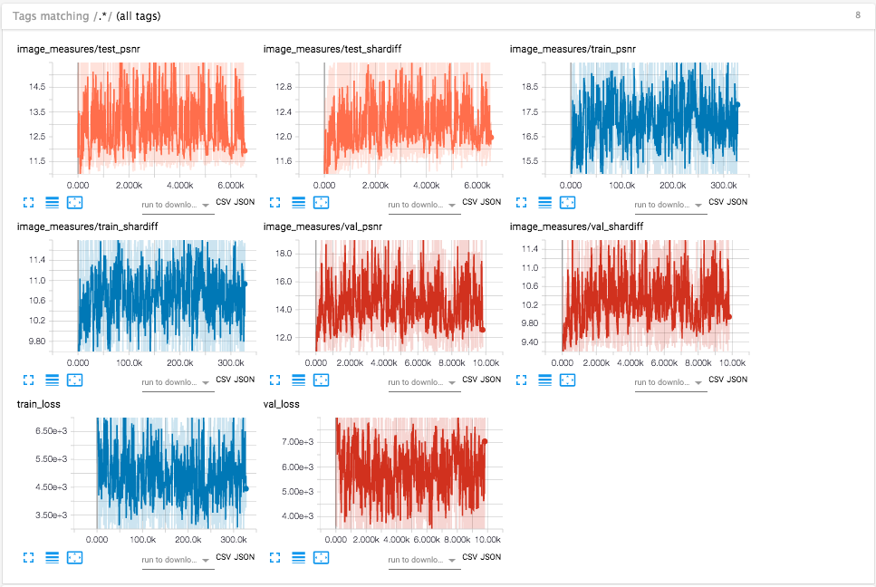

#### Expected vs Generated Output
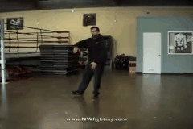
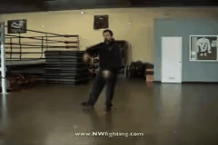


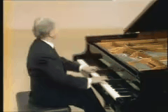
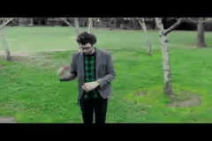


#### Advantages and Disadvantages

This model can work independent of shape of the frame. It is based on Convolutional layer and therefore, at testing time, we can feed frames of different sizes as compared to training time. It also captures motion and predicts more sharper frames than previous model.

This model becomes blur more quickly. Steady background doesn't get blur as compared to previous model. Model blurs the part where the actual motion happens.  


## Multi-Scale Model

### Architecture
Multi-scale architecture model is based on idea of predicting small resolution image and resolving the predicted image as model goes deeper. This model predicts one image at a time as opposed to the seq2seq model which predicts 4-8 images simultaneously. We now discuss the input requirements as multi-scale model expects the same input in different sizes.  

For example, given input images from `T0-T3` (each having `H,W` as height and width, in our case `64x64`) the model would try to predict `T4-T7`. Here we have 4 images with 3 channels each. As opposed to a seq2seq model where we feed images one by one as we loop through LSTM cells, here we feed all `4` images in one shot. So how can we achieve this?

Pile up all `4` images on top of each other like we do with playing cards or plates on a shelf. If we have 4 images with 3 channels each, we can think of this as 1 image having 12 channels i.e. `4 images x 3 channels = 12`. Let's call this new image as `I`. Please note that `I` will have the same `H,W` as the original image.


Just as we can have diffrent sizes for a shirt, like extra-small (XS), small (S), medium (M) and large (L), we can apply the same concept to our image. Currently, our `I` is `64x64x12`. Let's create different shapes as `I_XS`, `I_S`, `I_M`, `I_L` having sizes `4x4x12`, `16x16x12`, `32x32x12`, `64x64x12`.

This model can be represented in mutiple stages:
Stage 1 takes input of `4x4x12` i.e. `I_XS` and passes them through convolutional layers, which produces an output of shape `4x4x3` which is the first predicted image `O_XS`.   

Stage 2 will take input from output of Stage 1 (`O_XS`) and `I_S`. Here `O_XS` is reshaped to shape of `I_S`. The reshaped `O_XS` is concatenated with `I_S` according to channel axis. For instance, `I_S` (`16x16x12`) is concatenated with `O_XS` (`16x16x3`) to form `16x16x15`. 
  


The above process is repeated for Stages 3 and 4. Final output generated at each layer will be `O_XS` (`4x4x3`),`O_S` (`16x16x3`), `O_M` (`32x32x3`) , `O_L` (`64x64x3`) respectively.

The expected image is reshaped in the same way as input image i.e we will have images (`E_XS`,`E_S`,`E_M`,`E_L`). Let's the loss function be `L(.,.)`. We  calculate loss as sum of loss at each predicted layer i.e. `L(E_XS, O_XS) + L(E_S, O_S) + L(E_M, O_M) + L(E_L, O_L)`. In our case `L(.,.)` is L2 and GDL loss. L2 is pixel wise euclidean distance between predicted \(P\) and expected (E) image. GDL loss calculates `||P4 - P1| - |E4 - E1||`

Now let's make this architecture more interesting by introducing **Generative Adverserial Network (GAN) to this model**. Generator of GAN model is same as the model explained above.
In the discriminator step, the predicted output is flattened, and passed through a fully connected layer at every stage. The final output is a single value representing the magnitude of it being real or fake. At every stage this value indicates how we are doing in terms of mimicking the real next frame. Loss calculation is now sum of `l2`, `GDL` and `Discriminator loss`.  

### Model tweaks

We tried multi-scale setting without GAN model, i.e. we tried to optimize loss solely based on generator part of GAN. We realized that using only L2 loss produces blurred predictions as it seems to be converging towards the input mean. 

### Training and Testing

At training time, we feed 4 frames `T0-T3`, each having 4 different resolutions - `4x4`, `16x16`, `32x32` and `64x64`. The model outputs the predicted frame (`T4`) in the above mentioned resolutions.

At testing time (same as skip autoencoder) we feed 4 frames and predict one frame. For next time step we remove the oldest frame `T0` and add the newly predicted frame `T4` as input to the model.

#### Graphs
`T4` predictions as model learns over time:


#### Results


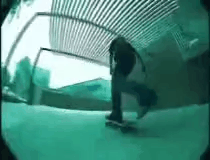

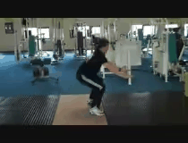

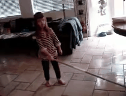
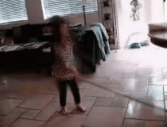


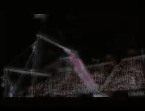


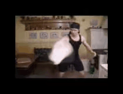

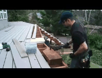
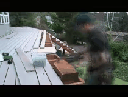
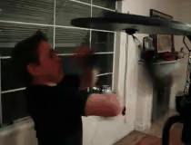

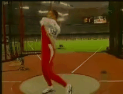

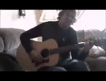


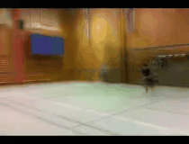


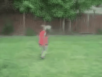


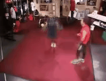


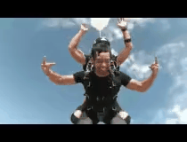


### Advantages and Disadvantages

Multi-scale model does pretty well in capturing motion and predicting next frames. This model is also fully based on convolution and therefore works with any shape of images at run time. As the model is trained using GAN it predicts  frames which look similar to real images. 

This model tries to predict pixels from scratch which causes bluriness for longer sequences.


## Evaluation

We evaluated the models on 5 different criteria as follows:
- Sharpness: Edge contrast of an image.
- Peak Signal to Noise Ratio (PSNR): Measure of quality of image reconstruction. 
- L2: Euclidean distance between predicted and expected frame.
- GDL: Calculates difference with respect to surrondings pixels to focus on local changes rather than global changes.
- Total loss: Sum of L2, GDL loss (Also contains discriminator loss in case of multi-scale architecture).
 
It is not possible to compare the above 3 models with each other directly since the model settings are different for each of them. We now show the performance of each model based on the aforementioned evaluation criteria:


## Future Scope
Although, our current results are pretty reasonable given the time constraints of this project, there is lot of scope for improvement. One particular approach that we want to explore in the future is to train a network that learns to synthesize video frames by flowing pixel values from existing ones instead of hallucinating pixel values directly. 
We expect the above approach to improve our results significantly and could also be a potential solution to overcome blurriness in our predicted frames.

We also plan to extend the above project to be able to make predictions on much longer frame sequences in the range of 32 to 64 frames from the 4 frames that we predict currently. Also, the UCF-101 dataset that we use for this work, contains videos across multiple domains which makes this a very difficult task. We expect our results to be much better on very specific problems like autonomous driving using single domain datasets like [Kitti](http://www.cvlibs.net/datasets/kitti/).

## Summary & Conclusion
We presented 3 different models to predict next video frames given an input sequence of frames namely seq2seq model, autoencoder model and multi-scale architecture model. We observed that the multi scale model produces the best results in terms of both capturing the motion as well as preventing blurriness.

We also tried gradient discriminator loss (GDL) as our loss function instead of the general L2 loss used in existing work on this problem.

## References
1. Mathieu, Michael, Camille Couprie, and Yann LeCun ”Deep multi-scale video prediction beyond mean square error.” arXiv preprint arXiv:1511.05440 (2015).
2. Vondrick, Carl, Hamed Pirsiavash, and Antonio Torralba. ”Generating videos with scene dynamics.”
3. Advances In Neural Information Processing Systems 2016. S. Hochreiter and J. Schmidhuber. Long short-term memory. Neural Comput, 9(8):1735–1780, Nov. 1997
4. J. Walker, A. Gupta, and M. Hebert. Dense optical flow prediction from a static image. CoRR , abs/1505.00295, 2015.
5. X. Shi, Z. Chen, H. Wang, D. Yeung, W. Wong, and W. Woo. Convolutional LSTM network: A machine learning approach for precipitation nowcasting. CoRR, abs/1506.04214, 2015.
6. Goodfellow, Ian, et al. ”Generative adversarial nets.” Advances in neural information processing systems 2014.
7. Liu, Ziwei, et al. "Video Frame Synthesis using Deep Voxel Flow." arXiv preprint arXiv:1702.02463 (2017).
8. Soomro, Khurram, Amir Roshan Zamir, and Mubarak Shah. "UCF101: A dataset of 101 human actions classes from videos in the wild." arXiv preprint arXiv:1212.0402 (2012).
9.  C. Finn, I. J. Goodfellow, and S. Levine. Unsupervised learning for physical interaction through video prediction. CoRR,
abs/1605.07157, 2016.

