Table of Contents
=================
 * [Data Source](#data-source)
    * [Datasets](#datasets)
    * [Preprocessing the input](#preprocessing-the-input)
    * [Postprocessing the input](#postprocessing-the-input)
    * [Batch Generation](#batch-generation)
    * [Selection at an interval](#selection-at-an-interval)
 * [Sequence to Sequence Model](#sequence-to-sequence-model)
    * [Architecture](#architecture)
    * [Training and Testing](#training-and-testing)
    * [Graphs](#graphs)
    * [Results](#results)
    * [Problems](#problems)
    * [Pretrained Weights](#pretrained-weights)
 * [Autoencoder Model](#autoencoder-model)
    * [Architecture](#architecture-1)
    * [Training and Testing](#training-and-testing-1)
    * [Graphs](#graphs-1)
    * [Results](#results-1)
    * [Problems](#problems-1)
    * [Pretrained Weights](#pretrained-weights-1)
 * [Multi-Scale Model](#multi-scale-model)
    * [Architecture](#architecture-2)
    * [Model twicks](#model-twicks)
    * [Training and Testing](#training-and-testing-2)
    * [Graphs](#graphs-2)
    * [Results](#results-2)
    * [Evaluation](#evaluation)
    * [Problems](#problems-2)
    * [Pretrained Weights](#pretrained-weights-2)

## Data Source

### Datasets

Even before anyone can think about making a predictive model, there is a need to identify and obtain a good source of data which will be used to train and test the model. Since our project is concerned with video frames prediction, it is very obvious that the model would need a lot of videos to get something meaningful out of it so that given a frame, the model is trained well enough to predict the future frames. 

We use the famous UCF-101 dataset for training the model. It is currently the largest dataset of human actions. They consist of 101 action classes and over 13k clips and 27 hours of video data. The classes describe different human actions which have been uploaded by the users containing camera motion and cluttered background.

Because some of the categories in the UCF-101 dataset have very little movement, we removed such categories altogether from the dataset. This identification was done using L2 distance between consecutive frames. (Ask what to write here)

### Preprocessing the input
The model works well when the data lies within the same range and so, the pixel values for all of the video frames in each of the video are transformed to somewhere between `[-1,1]`. To achieve this, each of the video , say X, is preprocessed using the formula X = (X - 127.5) / 127.5 instead of providing the raw video as input.

### Postprocessing the input
Because the model uses a tanh function at the end, the output generated by the model has pixel values lying in between `[-1,1]`. This output undergoes postprocessing so as to generate video frames. Say, the model produces a frame X, X is postprocessed using the formula X = X * 127.5 + 127.5.

### Batch Generation
Each batch consists of a certain number of videos and each video consists of a certain number of frames. The starting frame for each such video in a batch is selected randomly. For example, if the batch contains 4 videos and each video contains 4 continuous frames then, say for video-1 in the batch, we first generate a random number between `[0,1,2,3,...,(N-1)-4]` where video-1 contains N frames and each video in the batch requires 4 continuous frames. Say we generate the number `18`, then the frames `18, 19, 20, 21` become the input for video-1 in the current batch. Similar selection logic follows for other videos in the batch.

### Selection at an interval
While working with the way the videos were getting generated till now, it was observed that there was hardly any movement in the actual video due to which even the predicted video was very static. In order to overcome this, we came up with an approach of selecting video frames with a certain interval in between the selected frames rather than having continuous frames. Let's take the same example as above. Say we generate the number `18` and suppose we are using an interval of `4` frames, then the frames `18, 22, 26, 30` are selected as input for video-1 in the current batch. The reasoning behing this is that taking frames at an interval will have more movement rather than continuous frames and therefore, the model will be able to capture the actual movement well and will thus generate videos with movements rather than generating a static video.

## Sequence to Sequence Model

### Architecture
To speak in simple terms, a sequence to sequence model takes in a sequence of inputs, looks and observes at each input element in the sequence and then tries to predict the next element of the sequence. At a high level, it contains an encoder and a decoder as its main components. The encoder part of the model converts an input sequence (such as a sequence of video frames) into a fixed representation. The decoder part of the model is then trained on both the output sequence along with the fixed representation generated by the encoder. The decoder can therefore make more intelligent predictions about future frames based on the current frame as well as using the encoded representation from the encoder.

The encoder and decoder part of the model is created by using an LSTM Convolutional cell with a Convolutional layer below it and a Deconvolutional layer above it (only for the decoder part). In the encoder part, a Covolutional layer takes a raw video frame as input and passes its representation of the frame to an LSTM Convolutional cell. This hidden state is then propogated throughout the LSTM stack. In the decoder part, the output of decoder at each timestep becomes the input to the decoder at the next time step. This input is passed through a Convolutional layer whose output is then passed to an LSTM Convolutional cell just like the encoder with the only difference that the output generated by LSTM Convolutional cell is passed through a Deconvolutional layer which generates the predicted frame. Again, this predicted frame is passed as an input to the next decoder cell.

The specification for each of the Convolutional and Deconvolutional layer is the same as explained previously in the Vanilla Convolutional LSTM model (Insert URL here for Vanilla Convolutional LSTM model). The model takes in 4 frames as input and tries to predict the next 4 frames in the sequence as the output.

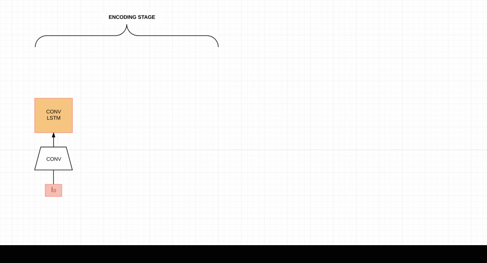

### Training and Testing
For training, we use a batch size of 16 videos with 4 frames each as input on the encoder side. On the decoder side, the actual next 3 frames of each of those 16 videos is passed as input while the output obtained from the decoder is used to calculate the loss and improve the model predictions.

For testing, we again use a batch size of 16 videos with 4 frames each as input on the encoder side. While, on the decoder side, the output generated by the previous decoder cell is used as an input for the next decoder cell.

### Graphs
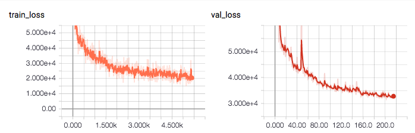

### Results
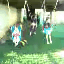
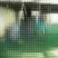

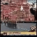
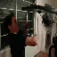
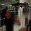

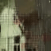
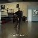
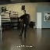
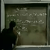
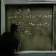

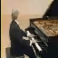

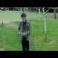
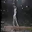
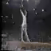
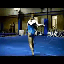
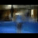

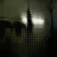
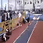
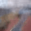
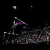
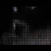
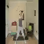
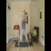
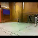
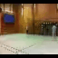
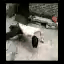
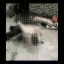
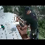
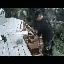
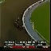
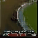
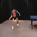
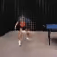
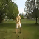
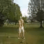
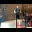
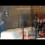
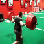
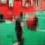

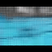

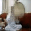
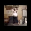

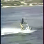
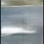
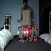
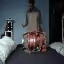
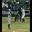
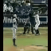

### Problems

Seq2Seq model is not able to capture motion very well. Overall image becomes blur and specially become more blur where motion happens. Another major problem is this model can not be scaled for large images as it is has Conv-LSTM cells in middle of Conv and DeConv layer. Conv-LSTM cells has fixed memory and we cannot run larger sized images at test time.

### Pretrained Weights

 

## Autoencoder Model

### Architecture
An autoencoder model is used for unsupervised learning in which the model tries to reconstruct the input so that the generated output is as similar as possible to the given input. Basically, it tries to copy its input to its output. At a high level, there are 2 symmetrical parts to an autoencoder - an encoder part and a decoder part. The encoder part of the network takes in raw images/video frames as input and tries to generate a vector representation or an encoding for the given input. The decoder part of the network takes this encoding of the input and tries to reconstruct the output as similar as possible to the input.

In our case, we make the decoder generate the next video frame given the current video frame instead of reconstructing the same input video frame. Also, The corresponding convolutional and deconvolutional layers are connected together by making use of skip connections. Each of the video frames has some spatial information associated with itself. The skip connections help in maintaining better spatial information.

The encoder portion of the autoencoder takes an input video frame and uses a feature map with the configuration as `[32, 64, 128, 256, 512]` while the decoder portion of the autoencoder uses the same feature map, but in the reverse order i.e. `[512, 256, 128, 64, 32]` and finally generates the output video frame which is supposed to be the generated next video frame.

### Training and Testing

### Graphs

### Results

### Problems

### Pretrained Weights

 

## Multi-Scale Model

### Architecture
Multi scale architecture model is based on idea of predicating small resolution image and resoluting the predicated image as model goes deeper. This model predicts one image at a time as opposed to seq2seq model where in one shot 4-8 images are predicated by LSTM. Multi-Scale model expects input in different form, so we will begin our discussion by describing input requirements.  

For sake of example, lets say we have given 4 frames and we are trying to predict next 4 frames, i.e. images are given from `t0-t3` (each having `H,W` as heigth and width, in our case `64x64`) and model is trying predict `t4-t7`. Here we have 4 images and each has channel `RGB` (3 channels). In seq2seq model we feed this images one by one as we loop through LSTM cells, here instead we will feed all `4` images in one shot. Now question comes to your mind how we will do this? Pile up all `4` images on top of each other like we do with playing cards or plates on stack/shelf. If we have 4 images with 3 channels each, you can think of them having 1 image of 12 channels i.e. `4 images x 3 channels = 12`. Lets call this new image as `I0`. Please note that `I` image will have same `H,W` as the original image.

In clothing as we see in shopping mall, same shirt has different sizes like xsmall (`XS`), small (`S`), medium (`M`), large (`L`), etc. We will do same with our image. Lets create 4 different shapes of same image. Currently our `I` is `64x64x12`. Let's create different shapes as `I_XS`, `I_S`, `I_M`, `I_L` having sizes `4x4x12`, `16x16x12`, `32x32x12`, `64x64x12`.

This model has mutiple stages, as game having multiple levels. Lets say we have 4 stages in our model (same as number of available shapes). `Stage 1` take input of `4x4x12` i.e. `I_XS` and pass through convolutional layers an gives output of shape `4x4x3` i.e. new image predication zeroth output `O_XS`.   

`Stage 2` will take input from output of `Stage 1` (`O_XS`) and `I_S`. Firstly, we will reshape `Stage 1` output to shape of `I_S`. In this case predicated `O0_XS` (`4x4x3`) will be reshaped to `16x16x3` (input shape of `I_S`). Now concatenate this new reshaped input with `I_S` at channel axis. `I_S` (`16x16x12`) concatenated with `16x16x3` to form `16x16x15` (12 channels from `I_S` +3 channels from `O_XS`). Each stage input will be passed through multiple convolutional layers.  

As we saw for `Stage 2` is taking scaled-up inputs from `Stage 1` and reshaped actual input. We will do same thing for `Stage 3` and `Stage 4` where we take input from previous stage output and reshaped input. (`Stage 1` doesnot take any previous input.) Final output generated at each layer will be `O_XS` (`4x4x3`),`O_S` (`16x16x3`), `O_M` (`32x32x3`) , `O_L` (`64x64x3`) respectively.

Now we will reshape expected image same as we done for input image, in this case we will have 4 different shaped expected image (`E_XS`,`E_S`,`E_M`,`E_L`). Lets out loss function is `L(.,.)`. We will calculated loss as sum of loss at each predicated layer i.e. `L(E_XS, O_XS) + L(E_S, O_S) + L(E_M, O_M) + L(E_L, O_L)`. In our case we are `L(.,.)` is `l2` and `GDL` loss. `L2` is pixel wise euclidean distance between predicated and actual image. `GDL` loss calculates `| |P4 - P1| - |E4 - E1| |` (as shown in below image)

Now lets make this architecture more exiciting by introducing **Generative Adverserial Network (GAN) to this model**. Generator of GAN model is same as model explained above. Discriminator model will be same as generator but with some additional changes. Now in Discriminator at each stage after predicating output (of shape as equal to image), we will flatten that output and connect fully connected layer in front of it. Final output will be single value showing how it is real/fake. At 4 stages we will have 4 of this value indicating at each layer how generator is doing in terms of mimicking the real next frame. Loss calculation is now sum of `l2`, `GDL` and `Discriminator loss`.  

### Model twicks

### Training and Testing

### Graphs

### Results

### Evaluation

### Problems

### Pretrained Weights
