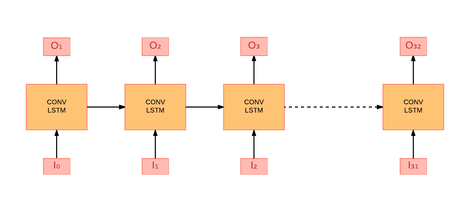
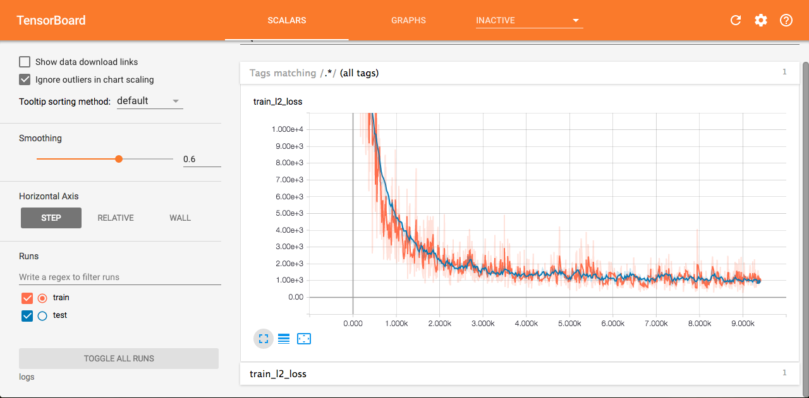

# Introduction
(Explain goal of the project)

# Model

## Vanilla Convolutional LSTM

LSTM takes only spatial information into consideration. In our case, we have spatial as well as temporal information. Thus, we use Conv LSTM in order to capture our task specific information. As mentioned [here](https://arxiv.org/pdf/1506.04214.pdf), Conv LSTMs is able to capture spatiotemporal information. 

The model comprises of stacked LSTMs.

(Input)
We are trying to predict next 32 frames, given one frame. Input and Output constitutes of `B, T, H, W, C` where `B` is Batch Size of images (to take advantage of parallel processing on GPU), `T` is timestep of input frames, `H` is height, `W` is width and `C` is number of channels. 

# Training

Our model takes 32 frames as input and predicts 32 output frames. During training the Conv LSTM, the real input is fed. However, at the testing time, the previous output is fed as the current input. 
Let the input frames be `I0, I1, I2, ...., I31` and output frames generated be `O1, O2, ...., O32`. Here, the input frames are real images.

# Testing

During testing time, previous output is fed as next input i.e `I1 = O1`,  `I2 = O2` and so on. Here only `I0` image is fed. Thus, in the input shape `B, T, H, W, C`, `T` i.e the timestep will become 1.

# Model specifications
The batch size `B` used is `4`, Timesteps `T` is `32`, Image shape `H, W` is `64, 64` and number of channels `C` used are `3`.
We have used the [l2](https://www.tensorflow.org/api_docs/python/tf/nn/l2_loss) loss along with the [Adam](https://www.tensorflow.org/api_docs/python/tf/train/AdamOptimizer) optimizer.

# Results obtained

This above image shows the train/test loss on Tensorboard.

# Problems
The smaller capacity of this model was an issue that we faced. Hence, we planned to change the model structure.

The above model was not very successful in learning the features from direct input at every layer. We realized the model needed to be fed with feature maps instead of the raw input images at every layer. Therefore we decided to adopt a Conv-Deconvolution architecture to learn features of the image.

## Deconvolutional LSTM

# Model specifications

We constructed 4 Convolution layers before LSTM.

Conv layer 1,
`Number of output filters` is `32`, `kernel size` is `[3,3]`.

Conv layer 2,
`Number of output filters` is `64`, `kernel size` is `[3,3]`, `stride` is `2`.

Conv layer 3,
`Number of output filters` is `128`, `kernel size` is `[3,3]`, `stride` is `2`.

Conv layer 4,
`Number of output filters` is `256`, `kernel size` is `[3,3]`, `stride` is `2`.

We constructed 5 Deconvolution layers after LSTM.

Deconv layer 1,
`Number of output filters` is `256`, `kernel size` is `[3,3]`.

Deconv layer 2,
`Number of output filters` is `128`, `kernel size` is `[3,3]` and `stride` is `2`.

Deconv layer 3,
`Number of output filters` is `64`, `kernel size` is `[3,3]` and `stride` is `2`.

Deconv layer 4,
`Number of output filters` is `32`, `kernel size` is `[3,3]` and `stride` is `2`.

Deconv layer 5,
`Number of output filters` is `3`, `kernel size` is `[3,3]` and `activation function` is `tanh`.

